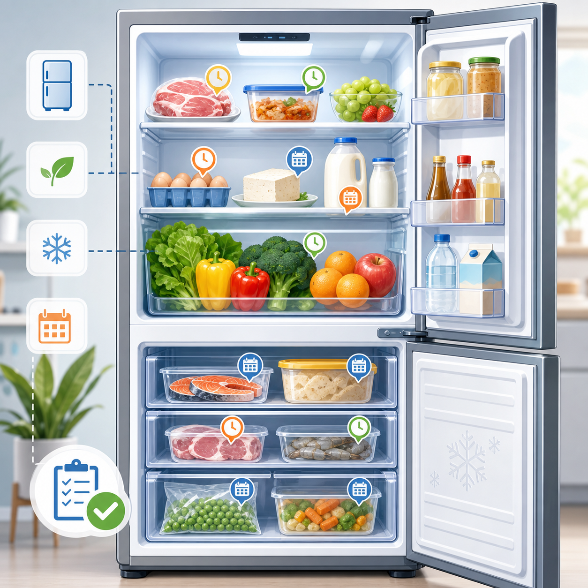

# Smart Refrigerator Manager



## Overview

Smart Refrigerator Manager is a small Python command-line project for tracking
food in a fridge or freezer. I built it around a simple problem: it is easy to
buy food twice, forget what is already there, and only notice it after it has
expired.

The program stores food records in CSV files, estimates expiry dates, and shows
urgent reminders before the main menu appears.

## Main Features

| Feature | What it does |
| --- | --- |
| Add food | Record name, type, quantity, storage location, and added date |
| Auto expiry calculation | Estimate expiry dates from a shelf-life guide |
| Fresh/freezer support | Use different shelf lives for fresh layer and freezer layer |
| Expiry reminders | Warn about expired food, food expiring today, and food expiring tomorrow |
| Inventory view | Group food by storage location and sort by expiry date |
| Consume/discard food | Remove food after it has been eaten or thrown away |
| Custom shelf-life guide | Add, edit, delete, or reset shelf-life rules |
| CSV storage | Keep inventory data after the program closes |

## How To Run

Put all project files in the same folder, then run:

```bash
python smart_refrigerator_manager.py
```

Optional tests:

```bash
python test_smart_refrigerator_manager.py
```

No external Python libraries are required.

## Files

| File | Purpose |
| --- | --- |
| `smart_refrigerator_manager.py` | Main program |
| `inventory.csv` | Saved food inventory |
| `shelf_life_guide.csv` | Saved custom or adjusted shelf-life rules |
| `test_smart_refrigerator_manager.py` | Optional tests |
| `README.txt` | Plain text project notes |
| `padlet_post.txt` | Draft text for the Padlet post |
| `smart_refrigerator_manager_poster.png` | Project display image |

## How The Program Works

When the program starts, it loads the inventory from `inventory.csv` and loads
any custom shelf-life rules from `shelf_life_guide.csv`. Before showing the main
menu, it checks whether any food is already expired, expires today, or expires
tomorrow.

When adding food, the user can choose a food type from the guide or enter a
custom type. If the type is in the guide, the expiry date is calculated
automatically. If not, the user can either enter the expiry date directly or
calculate it from a production date and shelf life.

The same food type can appear more than once. For example, `Pork mince` and
`Pork ribs` can both use the type `pork`, but they are stored as separate
records with different IDs, quantities, locations, and expiry dates.

## Shelf-Life Guide

The program has built-in default shelf-life values, but the user can adjust
them. This is useful because not every refrigerator works the same way. For
example, if an older fridge is not very cold, `pork` can be changed from 3 days
to 2 days in the fresh layer.

Shelf-life rules have three possible sources:

| Source | Meaning |
| --- | --- |
| `default` | Original built-in rule |
| `adjusted` | Built-in rule changed by the user |
| `custom` | New food type added by the user |

Deleting a custom rule removes it from the guide. Deleting an adjusted built-in
rule resets it back to the original default.

## Advanced Concepts Used

This project uses several COMP9001 advanced concepts:

| Concept | Where it appears |
| --- | --- |
| File I/O | Reading and writing `inventory.csv` and `shelf_life_guide.csv` |
| Exception handling | Using `try`, `except`, and `raise` for invalid input |
| Flow control | Using `while`, `break`, and `continue` in menu and input loops |
| Testing | Optional assert-based tests in `test_smart_refrigerator_manager.py` |

## Demo Plan

For a short presentation, I would show:

1. The main menu and automatic expiry reminder.
2. Adding a food item and choosing fresh layer or freezer layer.
3. Automatic expiry calculation from the shelf-life guide.
4. Custom or adjusted shelf-life rules.
5. Removing food after it is eaten or discarded.
6. The CSV files showing that data is saved.

## Note

The shelf-life numbers are simple estimates for this project. In real life, the
actual condition of food can also depend on packaging, fridge temperature, and
how the food was handled before storage.
